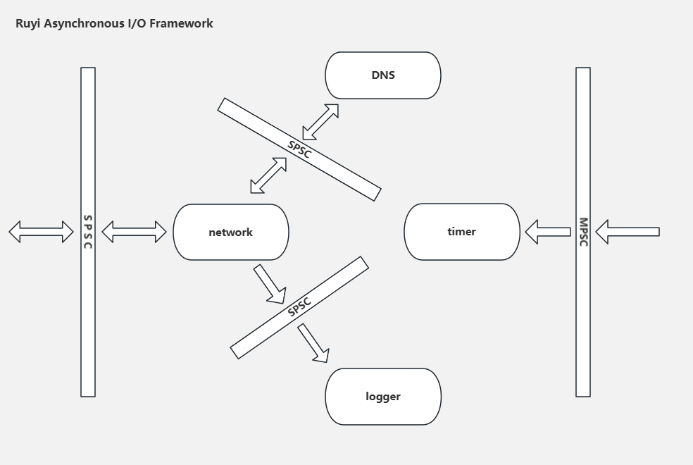
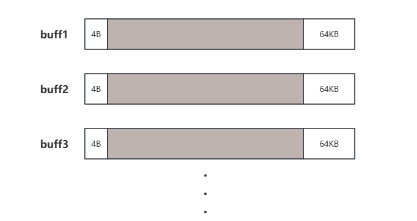

# ruyi

**ruyi** 是使用C实现的精简异步I/O库，对外提供最基础的网络事件和定时事件功能。 **ruyi** 的设计目的并不单单是造一个重复的轮子，更是期望把所造轮子打造得更圆滑。对于一个网络库来说，高吞吐量和低延迟是最直接的指标，但两者往往是冲突的，不同的网络库或者不同的配置都可以使其偏向某个指标。 **ruyi** 的设计目的很明确，在保证高吞吐量的同时，实现最低的读写延迟； **ruyi** 期望运行在较新的硬件和操作系统上，并不对老旧接口做兼容，内部逻辑简单明了，里面所使用的原子变量和一些POSIX标准函数，只有运行在受支持的硬件和软件系统上才能发挥出相应性能； **ruyi** 内部的内存设计非常激进，目前在启动初期就直接占用了近100M的内存，这也是典型的空间换取时间做法，内存不友好也是其性能表现之一

里面实现了4个功能模块：网络事件、DNS解析、定时事件、日志事件。其中只有网络事件和定时事件功能是对外提供使用的，下面对于这四个模块功能记录一下设计要点

## 日志事件

这个功能模块是专门用于打印内部网络事件的信息，采用了SPSC的设计。在现代SPSC的设计，（双缓冲/三缓冲/环形数组）结合无锁方案能达到最大性能，这里原本采用了环形数组的数据结构实现，但是在内部实现各种无锁队列之后，改用了SPSC无锁队列的实现方式。理由有以下几点：

1. 日志事件运行在独立的线程上，自身并不需要很高的输出性能，只需要提供极快的输入，让网络事件线程不在日志输出上面产生抖动
2. 环形数组因其自身设计能会出现极端情况下的日志丢失
3. 采用大缓冲区的策略会导致日志处理粒度增大，要是优化到达一定时间提交又会使其失去原本意义。为了尽可能减轻网络线程压力，日志时间的获取打印都由日志功能实现，大缓冲区的策略对于这种设计完全不适用

针对第三点，日志时间的获取打印都由日志功能实现，这是为了提升网络事件性能的设计。虽然当今大多数unix系统的时间函数都得到了优化，不再需要进入内核态，但频繁获取和格式化输入永远都是不能忽略的性能开销。对于内部网络日志，损失一点时间上的精度根本无伤大雅，只需要保证日志打印的正确顺序即可

## 定时事件

这里从实现的数据结构说起，要实现一个定时功能，流行的数据结构有以下几种：

1. 最小堆
2. 时间轮
3. 树
4. 排序链表

这里首先排除的是时间轮和树结构。时间轮有精度问题，而且个人不喜欢低级轮跑完一轮后时间槽位的重新分配，这是一个会带来性能抖动的设计，这与 **ruyi** 的设计初衷不符；对于树结构，不如选择排序链表，两者插入的时间复杂度都为 $O(n)$ ，但排序链表弹出首元素时间复杂度为 $O(1)$ ，排序链表比树结构有先天的优势。最后对于最小堆和排序链表（跳表）的选择，这里纠结了挺长一段时间，最后选择了最小堆实现。虽然跳表的弹出首元素时间复杂度为 $O(1)$ ，但考虑到实际的缓存击中问题，最小堆实现通常更优，这在一些数据结构测试也能得到验证

要使定时器的性能达到最优，就要尽可能的减少抖动，而定时器的抖动主要来源于以下几点：

1. 到期事件插入、获取
	+ 最小堆的实现中，数组可能面临重新分配，为了尽可能减少这个极低概率的抖动， **ruyi** 一开始就为其分配了 $2^{20}$ 个初始空间，后面直接按照倍数增长。这是一个典型空间换取时间的做法，在网络事件的设计中也有非常多的体现
2. 定时分辨率
	+ **ruyi** 提供的是1ms的时间分辨率。在这点上，个人觉得一些网络库提供十几毫秒的做法过于保守；对于比较早期的硬件系统来说，硬件延迟加上操作系统的调度延迟，精度可能不及设置，但现在硬件的速度越来越快，如果系统操作流水不繁忙，即使是软实时系统，也能达到毫秒级的实际精度
3. 事件回调执行耗时
	+ 对于较重的执行逻辑，建议是事件回压，但如何使用取决于用户的实际做法

然后是定时事件的删除逻辑，因为添加定时事件返回的是唯一事件id，所以这里采用也只能采用标记和延迟删除的做法。对于一个定时器来说，如果不实现删除功能，整个定时器实现逻辑会非常简单，虽然上层应用可以在回调函数里面判断事件到期后是否还有效，但无疑会增加编程时的心智负担

选择何种数据结构存储删除id也是一个问题，流行的选择无非就是树和哈希表，考虑到删除操作相比于插入操作来说可能少之又少，哈希表应该是更好的选择，但是要使得哈希表性能更好，又得引入冲突时使用的数据结构如链表，树等，**ruyi** 的设计初衷是精简，极致性能，所以内部并不想实现过多的数据结构。后来又考虑了位图等实现，但无论如何优化都处理不了id自增长的情况。苦闷之下突然意识到，以前所实现的[哈希表](https://github.com/olberix/structdata#9)使用的是链地址法，如果使用开放地址法，对于自增长id，面对固定的模数（数组长度），开放地址法简直完美适用于这种情况

## 网络事件

采用单线程Reactor模型，对于大多数服务主机来说，网络数据处理的瓶颈往往在于网卡的吞吐量，单线程Reactor足够处理这种情况，同时又能保证极低的写入，读取延迟。在网络事件中，性能优化最直接的点在于减少系统调用次数和数据拷贝，下面针对写入和读取的设计记录一下：

### write

业务线程投递写事件后，网络线程将全程接管写入数据，将其存储在待写链表中。当执行写事件时，使用`writev`	打包多个待写入数据以减少系统调用次数，当协议内部发送缓冲区满的时候，将其加入到polling中。现在的TCP协议实现，发送缓冲区会动态调整大小，`writev`对于频繁的小包来说，收益非常明显

## read

`read`策略是耗时最久的设计，这里采用了环形数组的存储结构，与可以无限增长的`write`不同，`read`数据可以通过TCP本身协议进行控制。为了减少数据拷贝，环形数组每个槽位都包含了一个大缓冲区和一个引用计数，每当读到一个完整的包，引用计数加一，并且基于当前位置向上层应用投放这个包，当上层应用使用完成后，引用计数减一，表示归还；当前槽位读完数据并且引用计数减少置0后，代表可以回收当前槽位的缓冲区。最终的问题在于如何读，在最初的设计中，采用`readv`拼接多个缓冲区的方式：

每个buff前面留出4字节，后面留出64KB（最大包长度），当前一个buff读完时，如果结尾恰好是包长度字节，就将其复制到下一个buff开始的4个字节里面，如果结尾还差数据组成一个完整的包，就将下一个buff开头的数据复制到当前buff结尾

但这里有一个问题，就是 **ruyi** 允许最大包长度为64KB，当buff间需要移动的数据较多时，耗时反而容易增加，一次空系统调用耗时约为100ns，而memcpy 64KB字节为微秒级。这里就存在一个取舍问题：大包和小包数据。readv的做法适合小数据，但对于大数据反而容易起到反作用。回归到实际情况，一个槽位的缓冲区大小为384KB，一次`read`能读取到的数据已经足够大，结合到实际不如改为为每个缓冲区调用`read`，这样的效果反而更好

当一个连接发生错误或者关闭时，会进入可清理状态；在网络事件每次循环开始，都会进行一次gc， **ruyi** 自身实现了对空连接的清理，用户可以调用相关函数设置超时时间，或者使用内部默认的5分钟；但是要注意，超时时间并不是精确的时间，假设不考虑执行各种事件的时间，理论上执行一次循环200us，面对65536个连接位置，最大会产生 $200us * 65536 ‌≈ 13s$ 的延迟，考虑到事件执行耗时，实际可能还会更高，要想实现精确的控制开关，需要用户在应用层使用心跳实现

## DNS解析

为了不阻塞网络事件，这里将DNS解析独立出来，如果上层应用不是http之类的协议，DNS解析相关的线程大多数时候都处于睡眠状态。用户调用listen、connect，都会先进入到DNS解析，最后再返回到网络事件进行处理

## todo list

1. 加入AF_LOCAL、UDP、IPv4/v6双栈支持
2. 加入kqueue实现，全面支持BSD、MacOS

